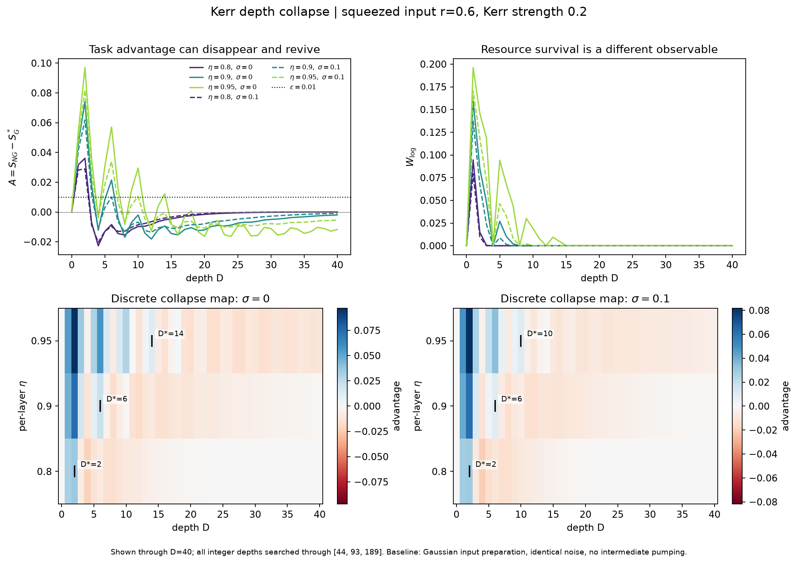

# Noise-Limited Non-Gaussian Photonic Circuits

[](https://github.com/jeorgexyz/noise-limited-non-gaussian-photonic-circuits/actions/workflows/tests.yml)
[](pyproject.toml)
[](LICENSE)

Where do loss, dephasing, circuit depth and resource placement end the operational
advantage of a non-Gaussian photonic circuit over a resource-matched Gaussian one?

**[Project page →](https://jeorgexyz.github.io/noise-limited-non-gaussian-photonic-circuits/)**
· [Research plan](RESEARCH_PLAN.md)
· [V1 prototype notes](PROJECT_SUMMARY.md)

---

## Status

The simulation core is built and validated against closed forms. The resource-decay
study, optimized Gaussian baseline, two operational task scores, and Kerr depth sweep
are complete. Experiment 02 includes discrete `(D, eta)` maps and a bound that excludes
later revivals. Resource placement and thermal-noise surfaces remain future work.

| | |
| --- | --- |
| Test suite | 387 passing |
| Validation vs. closed form | max error 2.8 × 10⁻⁵ |
| Backends | pure-NumPy reference + Piquasso 8.0.1, cross-validated |
| Scope | single-mode results; 1–4 modes planned, mixed-state Fock representation |

The V1 prototype at the repository root (`noise_collapse_study.py`,
`experimental_analysis.py`, `mrmustard_integration.py`) uses an assumed exponential decay
model rather than simulation. Its outputs characterise the analysis pipeline; quantitative
claims come from the V2 package in `src/ngphotonic/`. See [PROJECT_SUMMARY.md](PROJECT_SUMMARY.md).

## Approach

The project distinguishes three quantities rather than assuming they track each other.
Current experiments measure the first two; classical simulation difficulty remains a
planned axis:

```
resource survival  !=  task usefulness  !=  classical simulation difficulty
```

For a depth-`D` circuit with imperfection channels `N_l`, the advantage over the best
resource-matched Gaussian circuit under noise configuration `nu` defines a collapse
boundary:

```
A(D, nu) = S_NG(D, nu) - S_G*(D, nu)
D*(nu)  = max{ D : A(D, nu) > epsilon }
```

The Gaussian baseline is optimized under matched mean photon number, mode count, depth
and measurement family.

## Results so far

**Validation.** A single photon through pure loss of transmissivity `eta` has
`int|W| = 4 eta exp(-(1 - 1/(2 eta))) - 1` for `eta >= 1/2` and `1` below, so its Wigner
negativity vanishes at exactly `eta = 1/2`. Simulation reproduces this to 2.8e-05, with
the threshold located by bisection at `eta = 0.50502` at a survival tolerance of
1e-4, and at `eta = 0.5000` as that tolerance is taken to zero.

**Resource decay.** Critical transmissivity at `epsilon = 1e-3`:

| resource | `W_log` at `eta=1` | `eta*` |
| --- | --- | --- |
| Fock \|1> (control) | 0.3551 | 0.5163 ± 0.0008 |
| Fock \|2> | 0.5476 | 0.5343 ± 0.0012 |
| Fock \|3> | 0.6816 | 0.5520 ± 0.0014 |
| cat α=1.0 | 0.1891 | 0.5442 ± 0.0021 |
| cat α=1.5 | 0.3927 | 0.5281 ± 0.0014 |
| cat α=2.0 | 0.4625 | 0.5400 ± 0.0020 |
| Kerr(0.6)∘Sq(0.6) | 0.2326 | 0.5307 ± 0.0015 |

Higher Fock states carry more negativity but lose it at higher transmissivity. `eta*`
moves 0.505 → 0.701 for the single photon as `epsilon` ranges over 1e-4 to 1e-1, so
thresholds are reported with `epsilon` rather than alone.

**Advantage over an optimized matched Gaussian baseline.** Task: target-state
preparation, scored by fidelity. The baseline is the best energy-matched displaced
squeezed state found, passed through the same channel, so `A = S_NG - S_G*` compares
against the best Gaussian circuit found under stated constraints rather than an
arbitrary one.

| resource | `W_log` at `eta=1` | negativity threshold | advantage threshold (`A > 0.01`) | Gaussian wins |
| --- | --- | --- | --- | --- |
| Fock \|1> | 0.3551 | 0.5000 | `eta` in [0.10, 0.15] | never (min `A` = +0.007) |
| Fock \|2> | 0.5476 | 0.5005 | `eta` in [0.40, 0.45] | `eta <= 0.35` (min `A` = -0.022) |
| cat α=1.5 | 0.3927 | 0.5004 | `eta` in [0.40, 0.45] | `eta <= 0.35` (min `A` = -0.014) |

Two consequences. The negativity threshold is essentially the same (≈ 1/2) for all three
resources while the operational threshold differs by a factor of about three, so the
resource measure does not discriminate between resources that behave very differently on
the task. And Fock \|1>, which carries the least negativity of the three, is the most
operationally robust — more negativity does not mean more usefulness here.

There is a wide regime with `W_log = 0` and `A > 0`: a lossy single photon has no Wigner
negativity below `eta = 1/2` yet still beats the best matched Gaussian down to
`eta ≈ 0.15`. RESEARCH_PLAN.md anticipated the opposite pairing (`W_log > 0`, `A <= 0`);
both occur, so the two measures decouple in both directions.

Bounding the claim: the target is a state the non-Gaussian circuit holds exactly, so
`A > 0` at high transmissivity follows by construction. What does not is how far down in
`eta` the advantage persists. `S_G*` is a lower bound on the true Gaussian optimum, which
makes `A` an upper bound, so `A < 0` is the robust direction and `A > 0` carries the
convergence evidence (converged fraction and start spread are recorded per point).

**A second task reverses every verdict.** Phase estimation, scored by classical Fisher
information under homodyne detection, run on the same resources against the same
baseline construction:

| resource | `A` preparation (`eta=1`) | `A_F` phase estimation (`eta=1`) |
| --- | --- | --- |
| Fock \|1> | **+0.52** | **−16.00** |
| Fock \|2> | **+0.62** | **−47.98** |
| cat α=1.5 | **+0.25** | **−49.43** |

The sign flips for every resource, at every sampled noise level. Fock \|2> is best at
preparation, yet provides no phase information.
The mechanism is exact rather than numerical: `exp(-i θ n) |n><n| exp(i θ n) = |n><n|`,
so a Fock state carries no phase information under *any* measurement and its Fisher
information is identically zero. The resource that wins preparation most decisively is
provably the worst possible probe here.

The optimized baseline for this task has a closed form. For squeezed vacuum
`Var(n) = 2 n̄(1 + n̄)`, so `QFI = 8 n̄(1 + n̄)`, and homodyne saturates it; the optimizer
recovers exactly 16.0000 at `n̄ = 1` and 47.98 against 48 at `n̄ = 2`, with the optimum
at pure squeezing and no displacement.

So "operational usefulness" is not one axis. The negativity ranking does not
consistently predict performance across these two tasks.

**Noise axes are resource-specific.** Phase diffusion acts as
`rho_mn -> rho_mn exp(-sigma^2 (m-n)^2 / 2)`, so a Fock state is a fixed point at any
`sigma`, while cat-state fringes are removed. It also commutes exactly with pure loss, so
a layered circuit of those two alone reduces to a single `(eta^D, sigma sqrt(D))` channel
— depth becomes an independent axis only once a non-commuting element is present.

**Kerr depth collapse.** Experiment 02 starts with squeezed vacuum (`r = 0.6`) and
repeats `Kerr(0.2) -> loss(eta) -> dephasing(sigma)`. Both arms are scored against
the same noiseless output for each depth. The baseline optimizes a pure displaced
squeezed input with matched energy and identical noise exposures; all active Gaussian
preparation is at the input, with no intermediate pumping. This is a defined circuit
family, not an optimization over every possible noisy Gaussian circuit.

At `epsilon = 0.01`, the D* estimates are:

| per-layer `eta` | loss only | with per-layer `sigma = 0.1` |
| --- | --- | --- |
| 0.80 | 2 | 2 |
| 0.90 | 6 | 6 |
| 0.95 | 14 | 10 |

At `eta = 0.95` without dephasing, viable depths are **1–3, 5–7, 9–10, and 14**:
stopping at the first crossing would report 3 instead of 14. The sweep checks every
integer depth through 44, 93, and 189 respectively, where the bound
`A(D) <= 2 sqrt(n0 eta^D)` rules out all subsequent revivals. These are estimates
against the best Gaussian baseline found; the tail certificate does not prove that
the earlier baseline optima are global.



A second control holds total loss, phase variance, Kerr strength, input energy and
target fixed while changing the layer count. The output changes, reaching a trace
distance of **0.0382** from the lumped channel: depth is affecting the ordering of
operations, even at fixed total resource and noise budgets.

The [experiment protocol](experiments/02_depth_collapse/README.md) and
[tracked numerical report](experiments/02_depth_collapse/report.json) include the
dephasing cases, epsilon sensitivity, optimizer diagnostics, and cutoff/grid checks.
The [release review](RELEASE_REVIEW.md) distinguishes current evidence from planned extensions.

## Numerical caveats quantified

- **A soft energy constraint is unsafe for a monotone score.** Fisher information grows
  with energy, so a penalty-based baseline overspent its budget by ~15% rather than
  matching it. The baseline now uses exact energy-shell coordinates, where
  `n̄ = |α|² + sinh²r` equals the budget identically.
- **Truncation induces negativity in Gaussian states.** By Hudson's theorem a truncated,
  renormalised squeezed ket is non-Gaussian and carries numerical negativity; at `r=1.0`,
  cutoff 20 this reaches `W_log = 0.063`, 18% of a real single photon's 0.355.
- **Backend agreement is not always evidence.** For the cubic-phase gate both backends
  agree to 1e-17 while both differ from the converged result by 9.6e-05, identically —
  they exponentiate the same truncated `x^3`. Only cutoff convergence is informative there.

These effects are asserted by tests.

## Install and run

```bash
pip install -e .          # reference backend, no extras
pip install -e ".[sim]"   # adds the Piquasso backend

pytest tests/ -q
python experiments/00_validation/run_validation.py
python experiments/01_loss_threshold/run.py
python experiments/02_depth_collapse/run.py --publish
python experiments/02_depth_collapse/controls.py
python experiments/05_gaussian_baseline/run.py
python experiments/06_phase_estimation/run.py    # ~10 min
```

Piquasso tests skip automatically if the `sim` extra is absent.

## Layout

```
src/ngphotonic/     backends, noise channels, metrics, circuits, analysis
experiments/        reproducible runs; each writes JSON + a figure
tests/              closed-form, circuit-depth and cross-backend checks
docs/               project page (GitHub Pages)
figures/            curated figures referenced by the docs
results/            raw per-run output (gitignored)
```

Experiments run from scripts and configuration; notebooks are secondary.

## License

MIT — see [LICENSE](LICENSE).
